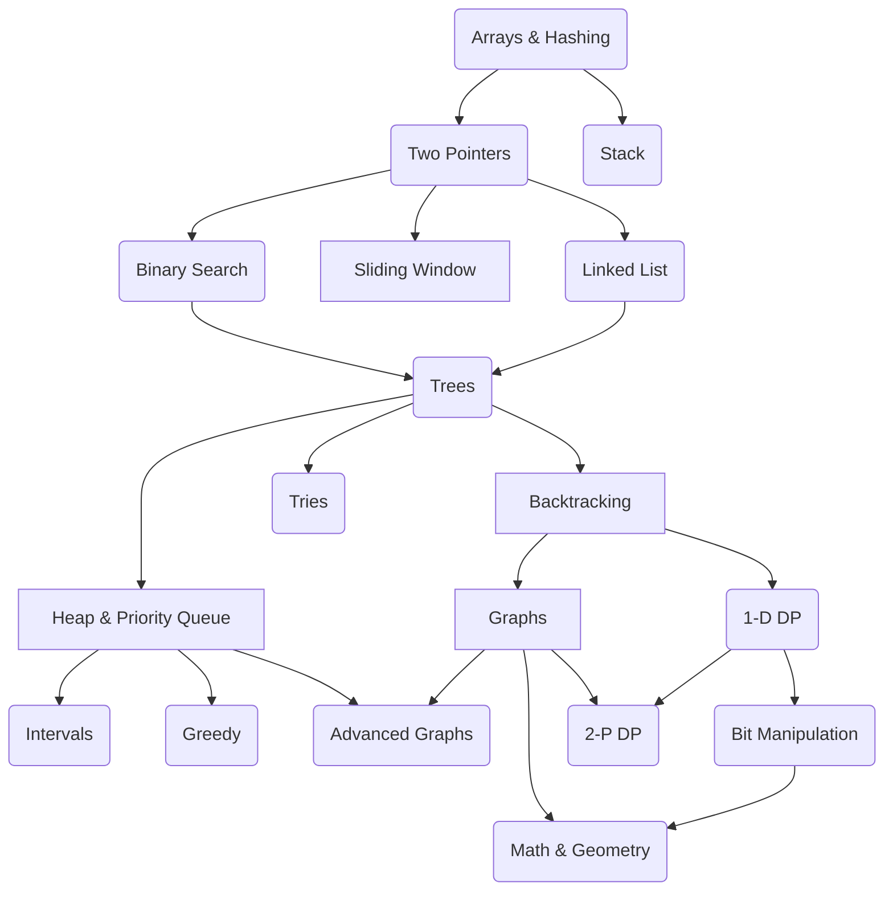

# Python Local Development 🐍

This is a Sandbox environment to practice my Python skills. I'm following the NeetCode roadmap.

### NeetCode roadmap
The NeetCode roadmap is a super useful guide designed to help you master coding interviews. It lays out a clear,
step-by-step plan to learn important data structures and algorithms, starting from beginner-friendly concepts and
working up to more advanced ones. The idea is to give you a structured path to follow, with curated problems from
LeetCode that you can practice along the way.

All credit to [Navdeep Singh](https://www.youtube.com/@NeetCode).
 Thank you 🙏 Navdeep for your work !

[https://neetcode.io/roadmap](https://neetcode.io/roadmap)

## Problems

### Arrays & Hashing

| Problem                                                                                    | Difficulty | Python Module                                                                 |
|--------------------------------------------------------------------------------------------|------------|-------------------------------------------------------------------------------|
| [Contains Duplicate](https://leetcode.com/problems/contains-duplicate)                     | Easy       | [contains_duplicate.py](src/arrays/contains_duplicate.py)                     |
| [Valid Anagram](https://leetcode.com/problems/valid-anagram)                               | Easy       | [valid_anagram.py](src/arrays/valid_anagram.py)                               |
| [Two Sum](https://leetcode.com/problems/two-sum)                                           | Easy       | [two_sum.py](src/arrays/two_sum.py)                                           |
| [Group Anagrams](https://leetcode.com/problems/group-anagrams)                             | Medium     | [group_anagrams.py](src/arrays/group_anagrams.py)                             |
| [Top K Frequent Elements](https://leetcode.com/problems/top-k-frequent-elements)           | Medium     | [top_k_frequent_elements.py](src/arrays/top_k_frequent_elements.py)           |
| [Encode and Decode Strings](https://leetcode.com/problems/encode-and-decode-strings)       | Medium     | [encode_decode_strings.py](src/arrays/encode_decode_strings.py)               |
| [Product of Array Except Self](https://leetcode.com/problems/product-of-array-except-self) | Medium     | [product_of_array_except_self.py](src/arrays/product_of_array_except_self.py) |
| [Valid Sudoku](https://leetcode.com/problems/valid-sudoku)                                 | Medium     | [valid_sudoku.py](src/arrays/valid_sudoku.py)                                 |
| [Longest Consecutive Sequence](https://leetcode.com/problems/longest-consecutive-sequence) | Medium     | [longest_consecutive_sequence.py](src/arrays/longest_consecutive_sequence.py) |

### Stack

| Problem                                                                                            | Difficulty | Python Module                                                                         |
|----------------------------------------------------------------------------------------------------|------------|---------------------------------------------------------------------------------------|
| [Valid Parentheses](https://leetcode.com/problems/valid-parentheses)                               | Easy       | [valid_parentheses.py](src/stacks/valid_parentheses.py)                               |
| [Min Stack](https://leetcode.com/problems/min-stack)                                               | Medium     | [min_stack.py](src/stacks/min_stack.py)                                               |
| [Evaluate Reverse Polish Notation](https://leetcode.com/problems/evaluate-reverse-polish-notation) | Medium     | [evaluate_reverse_polish_notation.py](src/stacks/evaluate_reverse_polish_notation.py) |
| [Generate Parentheses](https://leetcode.com/problems/generate-parentheses)                         | Medium     | [generate_parentheses.py](src/stacks/generate_parentheses.py)                         |
| [Daily Temperatures](https://leetcode.com/problems/daily-temperatures)                             | Medium     | [daily_temperatures.py](src/stacks/daily_temperatures.py)                             |
| [Car Fleet](https://leetcode.com/problems/car-fleet)                                               | Medium     | [car_fleet.py](src/stacks/car_fleet.py)                                               |
| [Largest Rectangle In Histogram](https://leetcode.com/problems/largest-rectangle-in-histogram)     | Hard       | [largest_rectangle.py](src/stacks/largest_rectangle.py)                               |
