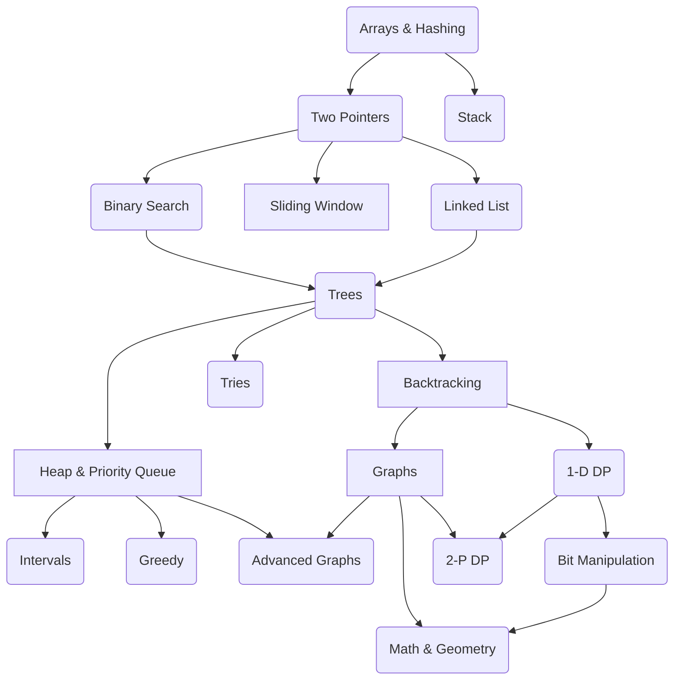

# NeetCode roadmap
The NeetCode roadmap is a super useful guide designed to help you master coding interviews. It lays out a clear,
step-by-step plan to learn important data structures and algorithms, starting from beginner-friendly concepts and
working up to more advanced ones. The idea is to give you a structured path to follow, with curated problems from
LeetCode that you can practice along the way.

All credit to [Navdeep Singh](https://www.youtube.com/@NeetCode).
 Thank you 🙏 Navdeep for your work !

[https://neetcode.io/roadmap](https://neetcode.io/roadmap)

## Problems

### Arrays & Hashing

| Problem                                                                                    | Difficulty | Python Module                                                             |
|--------------------------------------------------------------------------------------------|------------|---------------------------------------------------------------------------|
| [Contains Duplicate](https://leetcode.com/problems/contains-duplicate)                     | Easy       | [contains_duplicate.py](arrays/contains_duplicate.py)                     |
| [Valid Anagram](https://leetcode.com/problems/valid-anagram)                               | Easy       | [valid_anagram.py](arrays/valid_anagram.py)                               |
| [Two Sum](https://leetcode.com/problems/two-sum)                                           | Easy       | [two_sum.py](arrays/two_sum.py)                                           |
| [Group Anagrams](https://leetcode.com/problems/group-anagrams)                             | Medium     | [group_anagrams.py](arrays/group_anagrams.py)                             |
| [Top K Frequent Elements](https://leetcode.com/problems/top-k-frequent-elements)           | Medium     | [top_k_frequent_elements.py](arrays/top_k_frequent_elements.py)           |
| [Encode and Decode Strings](https://leetcode.com/problems/encode-and-decode-strings)       | Medium     | [encode_decode_strings.py](arrays/encode_decode_strings.py)               |
| [Product of Array Except Self](https://leetcode.com/problems/product-of-array-except-self) | Medium     | [product_of_array_except_self.py](arrays/product_of_array_except_self.py) |
| [Valid Sudoku](https://leetcode.com/problems/valid-sudoku)                                 | Medium     | [valid_sudoku.py](arrays/valid_sudoku.py)                                 |
| [Longest Consecutive Sequence](https://leetcode.com/problems/longest-consecutive-sequence) | Medium     | [longest_consecutive_sequence.py](arrays/longest_consecutive_sequence.py) |

### Stack

| Problem                                                                                            | Difficulty | Python Module                                                                     |
|----------------------------------------------------------------------------------------------------|------------|-----------------------------------------------------------------------------------|
| [Valid Parentheses](https://leetcode.com/problems/valid-parentheses)                               | Easy       | [valid_parentheses.py](stacks/valid_parentheses.py)                               |
| [Min Stack](https://leetcode.com/problems/min-stack)                                               | Medium     | [min_stack.py](stacks/min_stack.py)                                               |
| [Evaluate Reverse Polish Notation](https://leetcode.com/problems/evaluate-reverse-polish-notation) | Medium     | [evaluate_reverse_polish_notation.py](stacks/evaluate_reverse_polish_notation.py) |
| [Generate Parentheses](https://leetcode.com/problems/generate-parentheses)                         | Medium     | [generate_parentheses.py](stacks/generate_parentheses.py)                         |
| [Daily Temperatures](https://leetcode.com/problems/daily-temperatures)                             | Medium     | [daily_temperatures.py](stacks/daily_temperatures.py)                             |
| [Car Fleet](https://leetcode.com/problems/car-fleet)                                               | Medium     | [car_fleet.py](stacks/car_fleet.py)                                               |
| [Largest Rectangle In Histogram](https://leetcode.com/problems/largest-rectangle-in-histogram)     | Hard       | [largest_rectangle.py](stacks/largest_rectangle.py)                               |

### Two Pointers

| Problem                                                                                              | Difficulty | Local Code Link                                                          |
|------------------------------------------------------------------------------------------------------|------------|--------------------------------------------------------------------------|
| [Valid Palindrome](https://leetcode.com/problems/valid-palindrome)                                   | Easy       | [valid_palindrome.py](twopointers/valid_palindrome.py)                   |
| [Two Sum II - Input Array Is Sorted](https://leetcode.com/problems/two-sum-ii-input-array-is-sorted) | Medium     | [two_sum_ii.py](twopointers/two_sum_ii.py)                               |
| [3Sum](https://leetcode.com/problems/3sum)                                                           | Medium     | [three_sum.py](twopointers/three_sum.py)                                 |
| [Container With Most Water](https://leetcode.com/problems/container-with-most-water)                 | Medium     | [container_with_most_water.py](twopointers/container_with_most_water.py) |
| [Trapping Rain Water](https://leetcode.com/problems/trapping-rain-water)                             | Hard       | [trapping_rain_water.py](twopointers/trapping_rain_water.py)             |

### Binary Search

| Problem                                                                                                    | Difficulty | Local Code Link                                                                         |
|------------------------------------------------------------------------------------------------------------|------------|-----------------------------------------------------------------------------------------|
| [Binary Search](https://leetcode.com/problems/binary-search)                                               | Easy       | [binary_search.py](binarysearch/binary_search.py)                                       |
| [Search a 2D Matrix](https://leetcode.com/problems/search-a-2d-matrix)                                     | Medium     | [search_2d_matrix.py](binarysearch/search_2d_matrix.py)                                 |
| [Koko Eating Bananas](https://leetcode.com/problems/koko-eating-bananas)                                   | Medium     | [koko_eating_bananas.py](binarysearch/koko_eating_bananas.py)                           |
| [Find Minimum In Rotated Sorted Array](https://leetcode.com/problems/find-minimum-in-rotated-sorted-array) | Medium     | [find_min_in_rotated_sorted_array.py](binarysearch/find_min_in_rotated_sorted_array.py) |
| [Search In Rotated Sorted Array](https://leetcode.com/problems/search-in-rotated-sorted-array)             | Medium     | [search_in_rotated_sorted_array.py](binarysearch/search_in_rotated_sorted_array.py)     |
| [Time Based Key Value Store](https://leetcode.com/problems/time-based-key-value-store)                     | Medium     | [time_based_key_value_store.py](binarysearch/time_based_key_value_store.py)             |
| [Median of Two Sorted Arrays](https://leetcode.com/problems/median-of-two-sorted-arrays)                   | Hard       | [median_of_two_sorted_arrays.py](binarysearch/median_of_two_sorted_arrays.py)           |

### Sliding Window

| Problem                                                                                                                        | Difficulty | Local Code Link                                                                                                      |
|--------------------------------------------------------------------------------------------------------------------------------|------------|----------------------------------------------------------------------------------------------------------------------|
| [Best Time to Buy And Sell Stock](https://leetcode.com/problems/best-time-to-buy-and-sell-stock)                               | Easy       | [buy_sell.py](slidingwindow/buy_sell.py)                                                                             |
| [Longest Substring Without Repeating Characters](https://leetcode.com/problems/longest-substring-without-repeating-characters) | Medium     | [longest_substring_without_repeating_characters.py](slidingwindow/longest_substring_without_repeating_characters.py) |
| [Longest Repeating Character Replacement](https://leetcode.com/problems/longest-repeating-character-replacement)               | Medium     | [longest_repeating_character_replacement.py](slidingwindow/longest_repeating_character_replacement.py)               |
| [Permutation In String](https://leetcode.com/problems/permutation-in-string)                                                   | Medium     | [permutation_in_string.py](slidingwindow/permutation_in_string.py)                                                   |
| [Minimum Window Substring](https://leetcode.com/problems/minimum-window-substring)                                             | Hard       | [minimum_window_substring.py](slidingwindow/minimum_window_substring.py)                                             |
| [Sliding Window Maximum](https://leetcode.com/problems/sliding-window-maximum)                                                 | Hard       | [sliding_window_maximum.py](slidingwindow/sliding_window_maximum.py)                                                 |

### Linked List

| Problem                                                                                            | Difficulty | Local Code Link                                                                        |
|----------------------------------------------------------------------------------------------------|------------|----------------------------------------------------------------------------------------|
| [Reverse Linked List](https://leetcode.com/problems/reverse-linked-list)                           | Easy       | [reverse_linked_list.py](linkedlists/reverse_linked_list.py)                           |
| [Merge Two Sorted Lists](https://leetcode.com/problems/merge-two-sorted-lists)                     | Easy       | [merge_two_sorted_lists.py](linkedlists/merge_two_sorted_lists.py)                     |
| [Reorder List](https://leetcode.com/problems/reorder-list)                                         | Medium     | [reorder_list.py](linkedlists/reorder_list.py)                                         |
| [Remove Nth Node From End of List](https://leetcode.com/problems/remove-nth-node-from-end-of-list) | Medium     | [remove_nth_node_from_end_of_list.py](linkedlists/remove_nth_node_from_end_of_list.py) |
| [Copy List With Random Pointer](https://leetcode.com/problems/copy-list-with-random-pointer)       | Medium     | [copy_list_with_random_pointer.py](linkedlists/copy_list_with_random_pointer.py)       |
| [Add Two Numbers](https://leetcode.com/problems/add-two-numbers)                                   | Medium     | [add_two_numbers.py](linkedlists/add_two_numbers.py)                                   |
| [Linked List Cycle](https://leetcode.com/problems/linked-list-cycle)                               | Easy       | [linked_list_cycle.py](linkedlists/linked_list_cycle.py)                               |
| [Find The Duplicate Number](https://leetcode.com/problems/find-the-duplicate-number)               | Medium     | [find_the_duplicate_number.py](linkedlists/find_the_duplicate_number.py)               |
| [LRU Cache](https://leetcode.com/problems/lru-cache)                                               | Medium     | [lru_cache.py](linkedlists/lru_cache.py)                                               |
| [Merge K Sorted Lists](https://leetcode.com/problems/merge-k-sorted-lists)                         | Hard       | [merge_k_sorted_lists.py](linkedlists/merge_k_sorted_lists.py)                         |
| [Reverse Nodes In K Group](https://leetcode.com/problems/reverse-nodes-in-k-group)                 | Hard       | [reverse_nodes_in_k_group.py](linkedlists/reverse_nodes_in_k_group.py)                 |

### Trees

| Problem                                                                                                                                              | Difficulty | Local Code Link                                                                            |
|------------------------------------------------------------------------------------------------------------------------------------------------------|------------|--------------------------------------------------------------------------------------------|
| [Invert Binary Tree](https://leetcode.com/problems/invert-binary-tree)                                                                               | Easy       | [invert_binary_tree.py](trees/invert_binary_tree.py)                                       |
| [Maximum Depth of Binary Tree](https://leetcode.com/problems/maximum-depth-of-binary-tree)                                                           | Easy       | [maximum_depth.py](trees/maximum_depth.py)                                                 |
| [Diameter of Binary Tree](https://leetcode.com/problems/diameter-of-binary-tree)                                                                     | Easy       | [diameter_of_binary_tree.py](trees/diameter_of_binary_tree.py)                             |
| [Balanced Binary Tree](https://leetcode.com/problems/balanced-binary-tree)                                                                           | Easy       | [balanced_binary_tree.py](trees/balanced_binary_tree.py)                                   |
| [Same Tree](https://leetcode.com/problems/same-tree)                                                                                                 | Easy       | [same_tree.py](trees/same_tree.py)                                                         |
| [Subtree of Another Tree](https://leetcode.com/problems/subtree-of-another-tree)                                                                     | Easy       | [subtree_of_another_tree.py](trees/subtree_of_another_tree.py)                             |
| [Lowest Common Ancestor of a Binary Search Tree](https://leetcode.com/problems/lowest-common-ancestor-of-a-binary-search-tree)                       | Medium     | [lowest_common_ancestor.py](trees/lowest_common_ancestor.py)                               |
| [Binary Tree Level Order Traversal](https://leetcode.com/problems/binary-tree-level-order-traversal)                                                 | Medium     | [binary_tree_level_order_traversal.py](trees/binary_tree_level_order_traversal.py)         |
| [Binary Tree Right Side View](https://leetcode.com/problems/binary-tree-right-side-view)                                                             | Medium     | [binary_tree_right_side_view.py](trees/binary_tree_right_side_view.py)                     |
| [Count Good Nodes in Binary Tree](https://leetcode.com/problems/count-good-nodes-in-binary-tree)                                                     | Medium     | [count_good_nodes_in_binary_tree.py](trees/count_good_nodes_in_binary_tree.py)             |
| [Validate Binary Search Tree](https://leetcode.com/problems/validate-binary-search-tree)                                                             | Medium     | [validate_binary_search_tree.py](trees/validate_binary_search_tree.py)                     |
| [Kth Smallest Element in a BST](https://leetcode.com/problems/kth-smallest-element-in-a-bst)                                                         | Medium     | [kth_smallest_element_in_a_bst.py](trees/kth_smallest_element_in_a_bst.py)                 |
| [Construct Binary Tree from Preorder and Inorder Traversal](https://leetcode.com/problems/construct-binary-tree-from-preorder-and-inorder-traversal) | Medium     | [construct_binary_tree.py](trees/construct_binary_tree.py)                                 |
| [Binary Tree Maximum Path Sum](https://leetcode.com/problems/binary-tree-maximum-path-sum)                                                           | Hard       | [binary_tree_maximum_path_sum.py](trees/binary_tree_maximum_path_sum.py)                   |
| [Serialize and Deserialize Binary Tree](https://leetcode.com/problems/serialize-and-deserialize-binary-tree)                                         | Hard       | [serialize_and_deserialize_binary_tree.py](trees/serialize_and_deserialize_binary_tree.py) |
